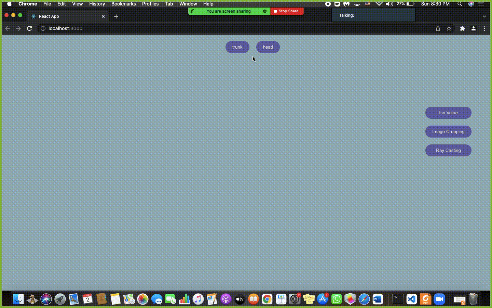

# Final Project: Volume Rendering (VTK) 
## Team name: meat-team

## Team members :  

| Name          | Sec  | BN   |
| ----------    | ---- |----  |
| Ahmed Hesham  | 1    | 8    |
| Asmaa Ibrahim | 1    | 12   |
| Alaa Moselhy  | 1    | 13   |
| Elijah        | 1    | 14   |

#### Our updates:

- [x] Loading Data for head and trunk using load button

- [x] Surface rendering with adjustable iso values

- [x] Raycasting rendering with a fixed transfer function

- [x] Interactive widget to cut volume in 3 perpendicular planes
     
> summary of our implementations :

- As we open the project the page will show 2 buttons that allow us to choose between head and trunk in addition to 3 buttons to choose between the modes of Visualization which are : 
  1. Surface rendring (Iso value) 
  2. Ray casting 
  3. Image cropping 

# Surface rendring (Iso value)
- In surface rendring which involves the collection of data on a head or a trunk in order to create a three-dimensional image of them.
- Then we used a slider to change the values so we can detect the diffrences. 

# Ray casting
- Secondly, in ray casting we used a transfer function maps data values to colors that can be used to visually display the data, and we can change between set of colors.

# Image cropping
- In image cropping page we made an interactive widget to cut the volume in the three perpendicular planes.

